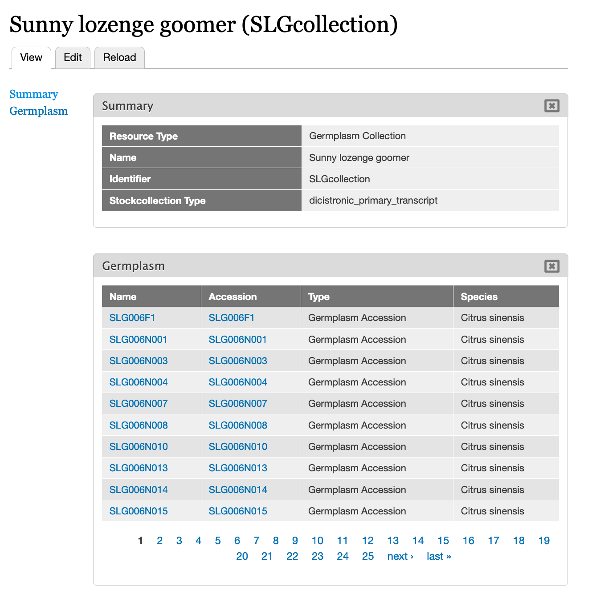
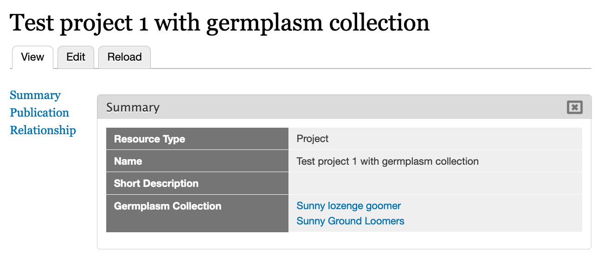

Germplasm Collection
======================

Provides functionality for supporting germplasm collection (e.g. diversity panels and recombinant inbred lines) including the following:

 - Germplasm Collection content type is created automatically.
 - Fields:
    - Germplasm List (co_010__germplasm): Listing of all germplasm in a collection.
    - Project-Related Germplasm Collection (local__project_germcollection): to link germplasm collections with projects.

Functionality
----------------

Germplasm Collection Pages
^^^^^^^^^^^^^^^^^^^^^^^^^^^^^

This module creates a germplasm collection content type which you can configure at Admin > Structure > Tripal Content Types > Germplasm Collection. By default, there will be a name, identifies, type of collection and germplasm list. The germplasm list will show all chado.stock records linked to a given chado.stockcollection record via the chado.stockcollection_stock table in an ajax-paged list.

.. warning::

  There is currently no way to link a Germplasm collection with germplasm (chado.stock) through the user interface. Instead, you will need to add records to chado.stockcollection_stock manually to create the link.

Link Germplasm to Projects
^^^^^^^^^^^^^^^^^^^^^^^^^^^^

There is also a field, Project-Related Germplasm Collection (local__project_germcollection), which links germplasm collections to projects. This can be used to indicated which germplasm are used for a given experiment. The following example shows two germplasm collections linked to a single project.

.. note::

  You can add germplasm collections to projects by editing a project and entering the germplasm collection name.
