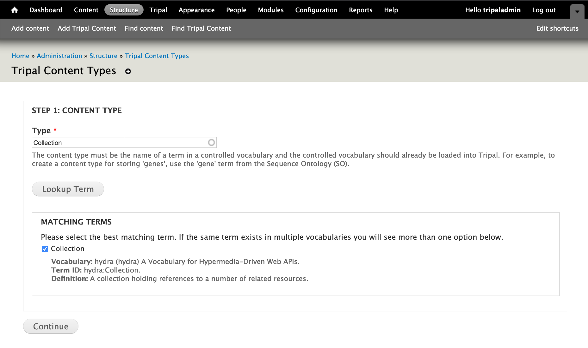
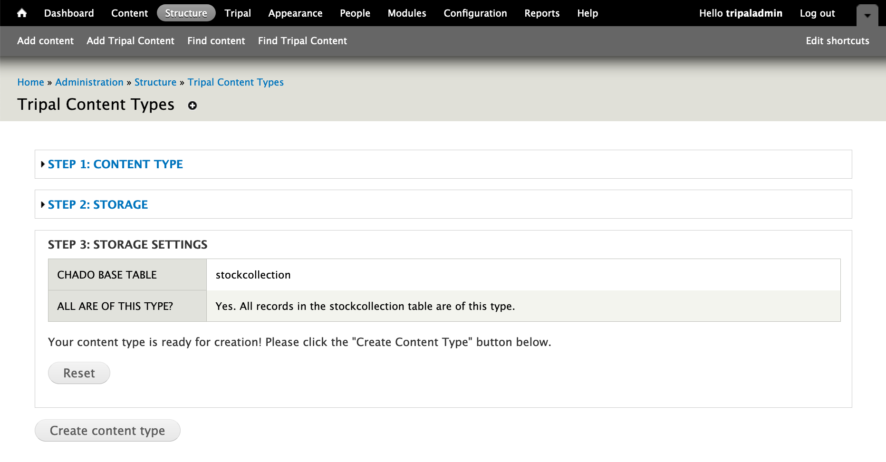

Germplasm Collection
======================

This module adds Tripal Fields to help extend Tripal Germplasm Collection pages.

.. warning::

  There is currently no way to link a Germplasm collection with projects, etc. through the user interface. Instead, you will need to add records to chado.project_stockcollection manually to create the link.

Create Germplasm Collection Content Type
------------------------------------------

To use these fields, you will first need to create a new Tripal Content Type:

1. Go to Home » Administration » Structure » Tripal Content Types and click on "Add Tripal Content Type".
2. Enter the name of term you would like to use to describe this content type. This will be shown in the admin interface and used in web services. We use ``hydra:collection`` but this term can be whatever you feel best represents this content.
3. Click "Lookup Term" and check the checkbox beside the correct term. Then click "Continue".

4. Choose "Chado" as the Storage Backend and click "Continue".
5. Choose ``stockcollection`` as the chado table and click "Continue".
6. Click the ``Yes`` radio button for ``Are all records in the "stockcollection" table of type "Collection"?`` and click "Continue".
7. Finally verify your storage settings are as follows and click "Create Content Type". You will need to run the submitted Tripal Job for the Content Type to be created.

