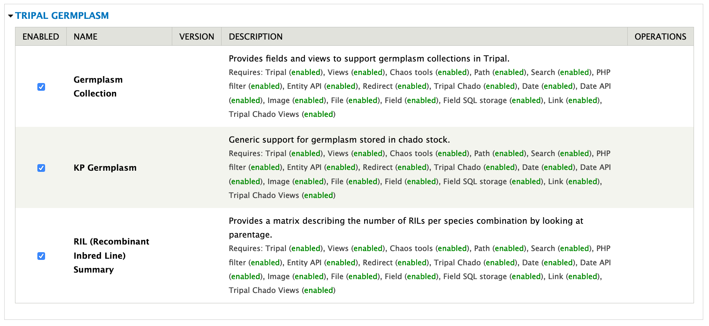

Installation
============

.. note::

  It is recommended to clear cashes regularly in this installation processes.

Download Package
------------------

The package is available as one repository for `Pulse Bioinformatics, University of Saskatchewan <https://github.com/UofS-Pulse-Binfo>`_ on GitHub. Recommended method of downloading and installation is using git:

.. code:: bash

  cd [your drupal root]/sites/all/modules

  git clone https://github.com/UofS-Pulse-Binfo/kp_germplasm.git

Enable Package
----------------

The module can be enabled in "Home » Administration » Tripal » Modules" by select the checkbox under "ENABLED" column (as shown in above image) and then click on "Save Configuration" button by the bottom of page.

Another method that can enable our module is using drush:

.. code:: bash

  drush pm-enable kp_germplasm rilsummary germpcollection

.. note::

  In this step, module required ontologies and controlled vocabularies will be inserted into Chado.

Set Permissions
---------------

By default, permission of using both importers in this module is not set. It can be configured in "Home » Administration » People » Permissions".

.. image:: install.4.permission.png

Import Data
------------
After the module is installed and enabled, both Germplasm Cross Importer and Germplasm Accession Importer should be ready to use in "Home » Administration » Tripal » Data Loader".

.. image:: install.2.cross_importer.png

.. image:: install.3.accession_importer.png

For more information on the importers, See the Data Import section of these docs.

.. note::

  The importers add data to from your file into Chado. You then need to publish that data by going to Admin > Content > Tripal Content > Publish and selecting either "F1" for crosses or "Germplasm Accessions".
