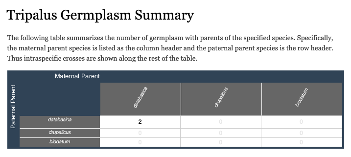
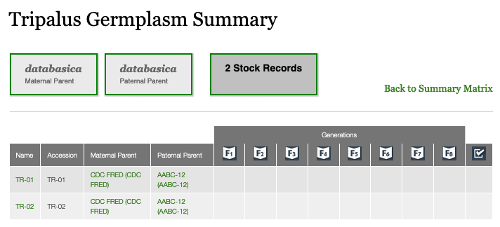
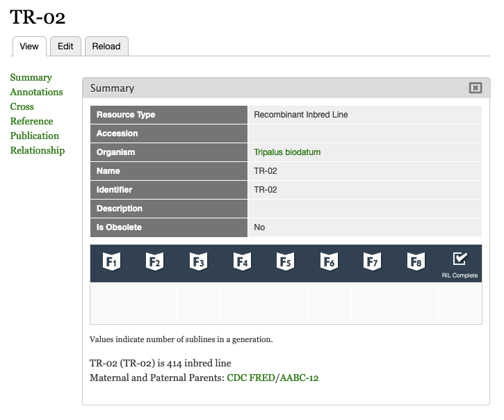

Recombinant Inbred Line (RIL) Summary
=========================================

Provides functionality for summarizing Recombinant Inbred Lines (RILs) including the following:

1. Tabular matrix which summarizes how many RILs are available for each species combination. This is particularly helpful if you have a cultivated and associated wild species for a single genus.
2. Listing of all RILs for a specific species combination including information about the number of F2 families for each F-generation.
3. ChadoField for RIL pages which summarizes information about the number of F2 families for each F-generation.

Functionality
---------------

The RIL summary matrix can be found at ``[mytripalsite.com]/germplasm/summary/[genus]``. This is what it looks like for a fake ``Tripalus`` example.

When you click on any of the cells in the RIL summary matrix you are taken to the following listing:

The details for a given RIL can be summarized on the RIL Tripal Content Page using the field provided by this module.

Adding RILs to the summary
----------------------------

1. Create a ``Recombinant Inbred Line`` with the name of your RIL population (e.g. TR-01).
2. Create a germplasm line (type doesn't matter; suggested ``Generated Germplasm (Breeding Line)``) with the name of the original cross giving rise to the RIL population (e.g. 1234S) and add a relationship: ``TR-01 is_selection_of 1234S``.
3. Create parents for the Breeding cross (type does not matter) and related them using the is_maternal_parent and is_paternal_parent relationship types (e.g. ``CDC FRED is_maternal_parent_of 1234S`` and ``AABC is_paternal_parent_of 1234S``).

Adding the summary to RIL pages.
---------------------------------

1. Go to Admin > Structure > Tripal Content Types > Recombinant Inbred Lines > Manage Fields.
2. Add a new field where the type is ``Germplasm RIL Summary``.
3. Make sure it is not disabled on the ``Manage Display`` tab.
